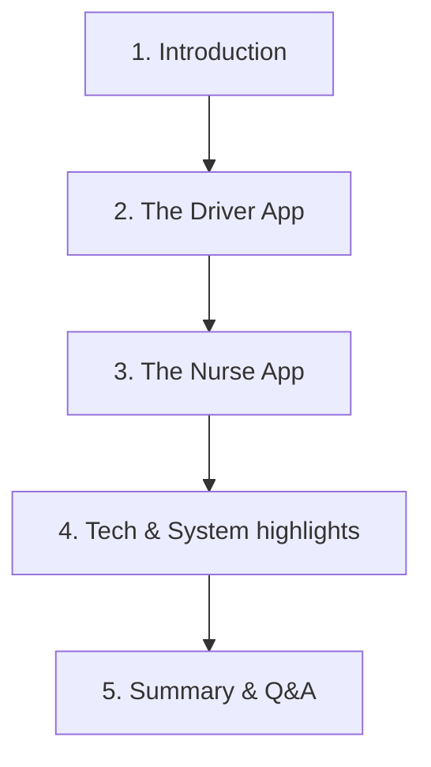

# 📋 Vitar Care Client Meeting & Feature Guide
This guide is prepared to help you present the features of the **Vitar Care (VitaCare)** apps to your client in a simple, professional, and confident manner. It contains a complete script in English, with brief explanations in Sinhala to guide your tone and flow.

---

## 🌟 Quick Meeting Preparation Checklist
Before you jump on the call with the client, make sure you have:
1. **The Apps Running**: Have both the **Nurse App** and the **Driver App** open on simulators (or on your physical phones).
2. **Demo Accounts Ready**: Logged-in accounts for both a Nurse and a Driver.
3. **Mapbox & GPS Working**: A valid Mapbox token (`EXPO_PUBLIC_MAPBOX_PK`) loaded so maps display correctly.
4. **Internet Connection**: A stable connection to ensure API calls to `https://vitar.medi.lk/api` succeed.

---

## 🗣️ The Step-by-Step Speaking Script



---

### Part 1: Meeting Welcome & Introduction
> **💡 Sinhala Explanation:** *මීටින් එක පටන් ගන්නකොට ක්ලයන්ට්ව සාදරයෙන් පිළිඅරගෙන, අපි අද කතා කරන්න යන්නේ Vitar Care සිස්ටම් එකේ ඇප්ස් දෙක (Nurse App සහ Driver App) ගැන කියල සරලව හඳුන්වලා දෙන්න.*

#### **English Script to Speak:**
> *"Hi everyone, thank you for joining today's meeting. Today, I want to walk you through the Vitar Care system. As you know, Vitar Care is designed to coordinate home nursing services efficiently. We have built two primary mobile applications to make this operation smooth:*
>
> 1. ***The Driver App** – for our transport drivers who navigate and drop off nurses.*
> 2. ***The Nurse App** – for our home nurses to manage their visits, mark attendance, and track their transport in real-time.*
>
> *Let's start by looking at the Driver App first."*

---

### Part 2: Explaining the Driver App (expo-driver-app)
> **💡 Sinhala Explanation:** *ඩ්‍රයිවර් ඇප් එකේ ස්ක්‍රීන් එක පෙන්නලා මේ විදිහට විස්තර කරන්න. ඩ්‍රයිවර්ස්ලට තමන්ගේ රූට් එක බලාගන්න, මැප් එකෙන් නෙවිගේට් කරන්න, සහ නර්ස්ව ඩ්‍රොප් කරපු එක කන්ෆර්ම් කරන්න පුළුවන් කියන එක පැහැදිලි කරන්න.*

```
📱 Driver App Layout:
+----------------------------------------+
|  [Morning Route] Doha, Qatar  [Active] |
+----------------------------------------+
|                [ MAP ]                 |
|   (Shows Nurse & Patient Locations)    |
|                                        |
+----------------------------------------+
|  ^ Nurse Drop-offs List (ETAs)        |
|  - Patient 1 (Assigned: Nurse Sarah)   |
|  - Patient 2 (Assigned: Nurse Jane)    |
+----------------------------------------+
```

#### **English Script to Speak:**
> *"Here is the **Driver App**. It is designed to be very clean so drivers can use it easily while on the road. Here are the key features:*
>
> * **Shift-Based Routes**: The dashboard automatically loads the current shift's route—like the Morning Route or Afternoon Route.
> * **Interactive Mapbox Integration**: The map shows the driver's current position, the nurse's location, and the patient's home.
> * **Drop-off & Pickup List**: At the bottom, drivers see a detailed list of nursing visits. It displays the **Patient's Name**, their **Address**, the **Assigned Nurse**, and the **Expected Arrival Time (ETA)**.
> * **Google Maps Navigation**: When the driver taps on a pickup card, they can click 'Navigate' which directly opens Google Maps with driving directions to the patient's house.
> * **Live Distance Calculation**: The app uses GPS coordinates to calculate the exact distance between the vehicle and the patient's house in real-time.
> * **Confirm Drop-Off**: Once the driver successfully drops the nurse at the patient's home, they tap 'Confirm Drop-off'. This immediately updates the status in the backend and logs it."*

---

### Part 3: Explaining the Nurse App (expo-nurse-app)
> **💡 Sinhala Explanation:** *දැන් නර්ස් ඇප් එක පෙන්නන්න. නර්ස්ලට වැඩ ලේසි වෙන්න, තමන්ගේ ඇටෙන්ඩන්ස් (shift clock-in/out) මාර්ක් කරන්න සහ තමන්ව එක්කන් යන්න එන වෑන් එකේ (driver) ලයිව් එකවුන්ට් එක මැප් එකෙන් බලාගන්න පුළුවන් කියන එක මෙතනදි කියන්න.*

```
📱 Nurse App Layout:
+----------------------------------------+
|  Attendance  |  Visits  |  Profile     |
+----------------------------------------+
|  🟢 Check In / Check Out (Al Sadd)      |
|  🕒 Shift Hours Counter: 11h 10m       |
+----------------------------------------+
|  🗺️ Real-time Driver Tracker (Map)    |
|   - Teammate Status (At Work / SOS)    |
+----------------------------------------+
```

#### **English Script to Speak:**
> *"Now, let's switch to the **Nurse App**. This app is customized for our nurses to manage their daily schedules and stay safe. Its main features are:*
>
> * **Easy Attendance Tracking**: Under the 'Attendance' tab, nurses can 'Check In' to start their shift and 'Check Out' to end it. The app automatically logs the check-in/out times, total hours worked, and their physical location (for example, Al Sadd, Doha).
> * **Real-Time Van Tracking**: On the home screen map, nurses can see the exact real-time location of the driver's vehicle (the transit van). They don't need to call the driver to ask where they are; they can see it moving on the map.
> * **Teammate Monitoring & Safety**: Nurses can see their active team members on the shift. It shows each nurse's status (such as 'At Work', 'In Transit', or 'SOS' emergency status), their phone number, and even their phone battery level.
> * **Visit Schedules & Details**: Under the 'Visits' tab, nurses can see their schedule of patients. Selecting a patient displays their details, address, and medical diagnosis, helping the nurse prepare beforehand."*

---

### Part 4: Tech Stack & System Highlights (Backend)
> **💡 Sinhala Explanation:** *ඇප්ස් දෙක ක්‍රියාත්මක වෙන තාක්ෂණික පැත්ත ගැන පොඩි අදහසක් දෙන්න. Backend එකෙන් ලයිව් අප්ඩේට්ස් වෙන හැටි සහ Offline ඩේටා සේව් වෙන හැටි පැහැදිලි කරන්න.*

#### **English Script to Speak:**
> *"From a technical perspective, both apps are built on top of robust frameworks:*
>
> * **Framework**: Built using React Native and Expo for a fast, native mobile experience on both Android and iOS.
> * **Maps & Tracking**: Powered by Mapbox GL, offering smooth map rendering and precise coordinate plotting.
> * **Backend Communication**: Both apps communicate with our centralized secure API hosted at `vitar.medi.lk`.
> * **Data Persistence**: We use AsyncStorage, meaning even if the driver or nurse temporarily loses mobile network coverage, the app stores critical data locally and syncs once connection is restored."*

---

### Part 5: Conclusion & Opening for Questions
> **💡 Sinhala Explanation:** *අන්තිමට, සිස්ටම් එකෙන් ලැබෙන ප්‍රධාන වාසි ටික කෙටියෙන් සාරාංශ කරලා, ක්ලයන්ට්ට මොනවා හරි ප්‍රශ්න තියෙනවද අහන්න.*

#### **English Script to Speak:**
> *"In summary, the Vitar Care application suite provides a seamless connection between drivers, nurses, and the head office. It ensures:
>
> * Better time management with accurate ETAs.
> * Enhanced safety for nurses through live tracking and battery/SOS statuses.
> * Higher efficiency by reducing calls between drivers and nurses.
>
> Thank you very much. I would love to answer any questions or receive your feedback on the system."*

---

## 🙋 Handling Common Client Questions (Q&A)

Here are simple English answers to typical questions the client might ask:

#### **Q1: What happens if there is no internet coverage?**
* **Answer to speak:** *"The app uses local storage to save critical session info. While a live connection is needed for real-time GPS tracking, essential details like visit lists and attendance check-ins are saved offline and synced when the connection returns."*

#### **Q2: Does the GPS tracking drain the nurse's phone battery?**
* **Answer to speak:** *"We have optimized location updates. The driver's location is actively sent because they are driving, but the nurse's app mostly receives the driver's location, which uses very minimal battery power."*

#### **Q3: How are patient addresses mapped if the coordinates are missing?**
* **Answer to speak:** *"We have implemented a fallback system. If the exact coordinates are missing, the app parses the Google Maps link provided in the database to extract coordinates and guide the driver accurately."*
